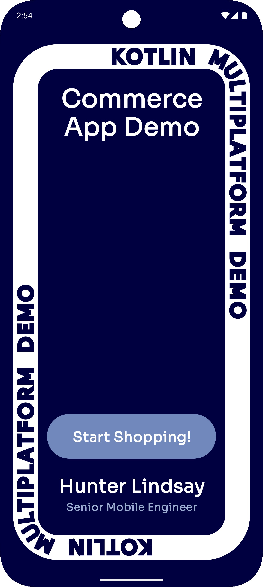
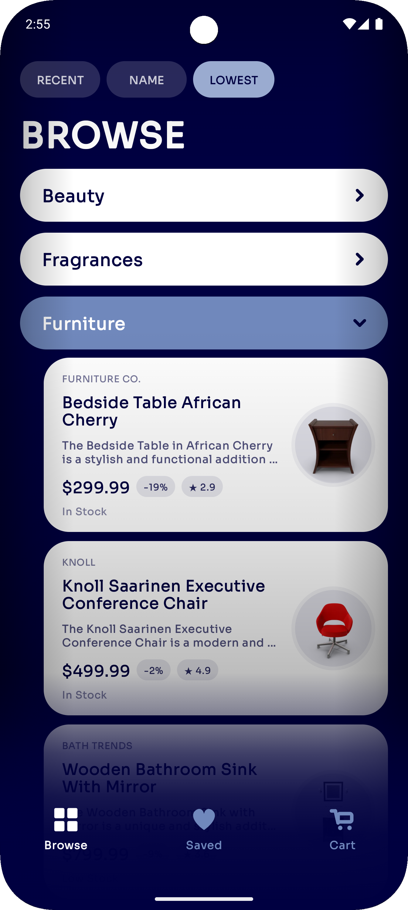
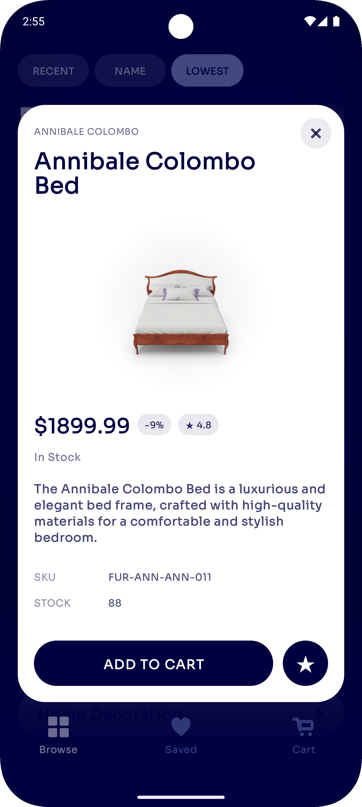
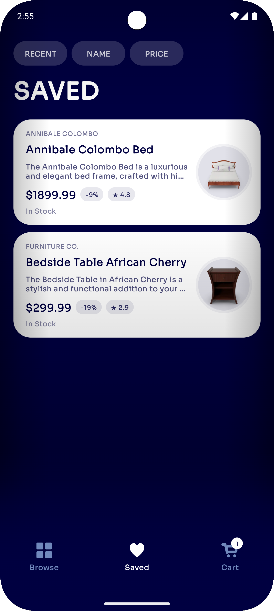
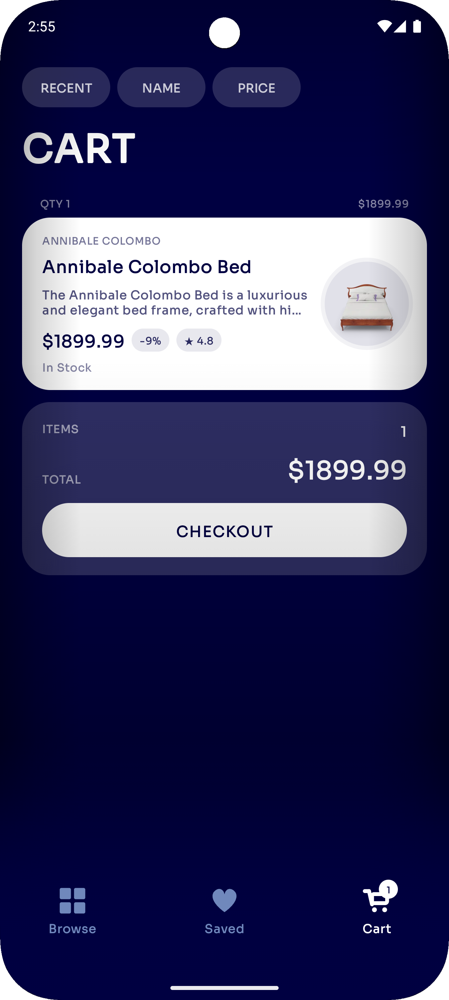
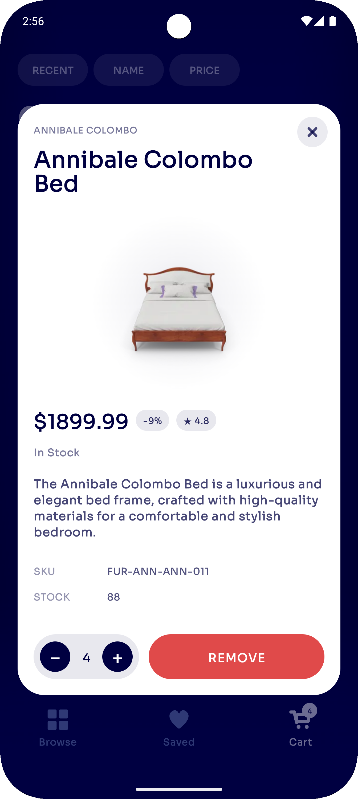
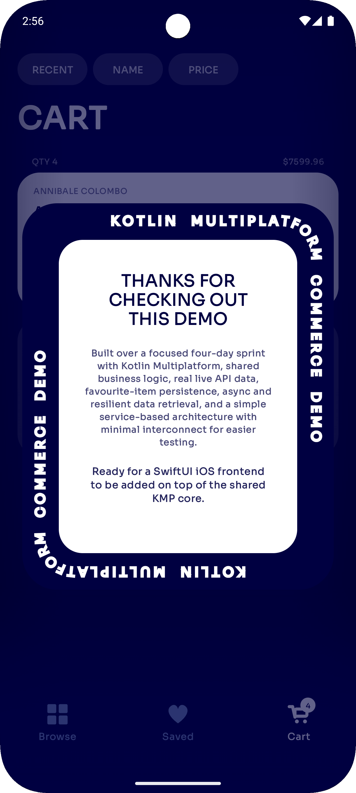

# KMP Commerce Demo

A focused Kotlin Multiplatform commerce demo built over a 4-day sprint.

This project demonstrates shared Kotlin business logic, Android Jetpack Compose UI, real live API data, async product/category loading, favourite-item persistence, cart flow, sorting, and custom animations.

Video demo: https://drive.google.com/file/d/1Jq_cii5yrTpa_dd3Yek6045J2ZawwDGI/view?usp=share_link

## Screenshots

  
  
  

  
  
  

  

## Quick Links

- [Shared product/business logic](shared/src/commonMain/kotlin/com/hunterlindsay/kmpcommercedemo/concerns/products)
- [REST client / networking layer](shared/src/commonMain/kotlin/com/hunterlindsay/kmpcommercedemo/concerns/rest)
- [Dependency setup](shared/src/commonMain/kotlin/com/hunterlindsay/kmpcommercedemo/concerns/dependencies)
- [Android Compose UI](androidApp/src/main/java/com/hunterlindsay/kmpcommercedemo/android/ui)
- [Browse UI](androidApp/src/main/java/com/hunterlindsay/kmpcommercedemo/android/ui/browse)
- [Core app shell / tabs / overlays](androidApp/src/main/java/com/hunterlindsay/kmpcommercedemo/android/ui/core)
- [Cart UI](androidApp/src/main/java/com/hunterlindsay/kmpcommercedemo/android/ui/core/cart)
- [Saved/Favourites UI](androidApp/src/main/java/com/hunterlindsay/kmpcommercedemo/android/ui/saved)
- [Product tests](shared/src/commonTest/kotlin/com/hunterlindsay/kmpcommercedemo/concerns/products)

## Highlights

- Shared KMP product/business layer
- Android frontend built with Jetpack Compose
- Real live API data from DummyJSON
- Category-level product loading
- Skeleton loading states
- Product detail overlay
- Saved/favourite products
- Local favourite-item persistence
- Cart quantity handling
- Sorting across Browse, Saved, and Cart
- Checkout demo animation
- Structured so a SwiftUI iOS frontend could be added later

## Built By

Hunter Lindsay
